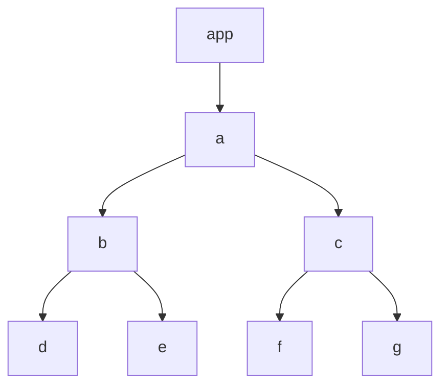

# learn-mini-react

## 在页面中呈现内容

1. 通过命令式编程，实现 dom 的渲染
2. 优化，引入 vdom 的概念，动态创建 vdom，通过命令式编程，dom 创建时候，dom 的类型和属性通过软编码方式进行设置

```js
const vdom = {
  type: "div",
  props: {
    id: "app",
    children: [
      {
        type: "TEXT_ELEMENT",
        props: {
          nodeValue: "hello mini-react!",
          children: [],
        },
      },
    ],
  },
};
```

3. 优化，引入动态渲染，定义 render 函数。

```js
function createElement(type, props, ...children) {
  return {
    type,
    props: {
      ...props,
      children,
    },
  };
}

// container 是一个真实dom节点
function render(vdom, container) {
  // 创建dom
  // 为dom添加属性
  // 递归创建vdom.props.children
  // 将创建好的dom插入到container中
}
```

4. 重构成 ReactApi

```js
const ReactDom={
  createRoot(container){
    return {
      React.render(vdom,container)
    }
  }
}

const React ={
  createElement,
  render
}
```

5. 引入 jsx，简单通过 vite 工程化，将文件改成 jsx 类型，就可以使用，本质是 esBuild 自动根据引用的 ReactApi，将 jsx 编译成 ReactApi 调用。

## 如果 vdom 内部的 elNode 过多，那么一次行渲染大量 dom，会导致页面卡顿，该如何处理？

#### 1. 将 vdom 拆分为多个 vdom，

#### 2. 然后分多次行渲染，采用 requestIdleCallback 分帧运算

6. 在浏览器空闲时，执行渲染任务。requestIdleCallback，在浏览器空闲时期被调用。https://developer.mozilla.org/zh-CN/docs/Web/API/Window/requestIdleCallback

```js
requestIdleCallback(IdleDeadline => {
  // 返回当前空闲期剩余时间，单位毫秒
  const leftTime = IdleDeadline.timeRemaining();
  // 如果剩余时间 < 1
  // 那么再创建一个requestIdleCallback ，等待下次空闲时候执行
});
```

7. 将 vdom 转换成更适合分割任务的数据结构，链表，方便进行任务的拆分，以及渲染



转换成链表的规则：

> 1. 先 child
> 2. 然后 sibling
> 3. 最后 parent.sibling

上面的转换成链表就是：a --> b --> d --> e --> c --> f --> g

8. 因为转换成链表的数据结构，所以，每次执行的话，可以从之前的位置继续执行，而不会产生顺序问题

```js
let nextWorkOfUnit = {
  type,
  props,
  child,
  sibling,
  parent,
  dom,
};

// 增加 workLoop 函数，该函数为 requestIdleCallback 的回调函数，在此函数中，进行任务调度
function workLoop(deadline) {
  // ...
  nextWorkOfUnit = performWorkOfUnit(nextWorkOfUnit);
  // ...
}

// 增加函数 performWorkOfUnit，在此函数中，将vdom转换成链表数据结构
function performWorkOfUnit(fiber) {
  // fiber是个vdom
  // 1. 创建dom，然后添加到父级容器中
  // 2. 处理props
  // 3. 将vdom转换成链表，设置好指针
  // 4. 返回下一个要执行的任务
}

// render 中逻辑整理成这个样子
function render(elNode, container) {
  nextWorkOfUnit = {
    dom: container,
    props: {
      children: [elNode],
    },
  };
}
```

实际上，将渲染切片任务（dom 渲染）放在了 performWorkOfUnit 中，开启 requestIdleCallback，轮询执行切片任务。而 render 只是生成了首个任务切片的数据结构。

### 疑问：空闲时间内，会不会没有执行完一个任务切片？没有执行完，会中断执行吗？如果中断了，该如何恢复？

## 中途有可能没有空余时间继续执行渲染，那么用户只会看到渲染一半的 dom，如果处理？

#### 1. 计算结束后，统一添加到 dom 中
