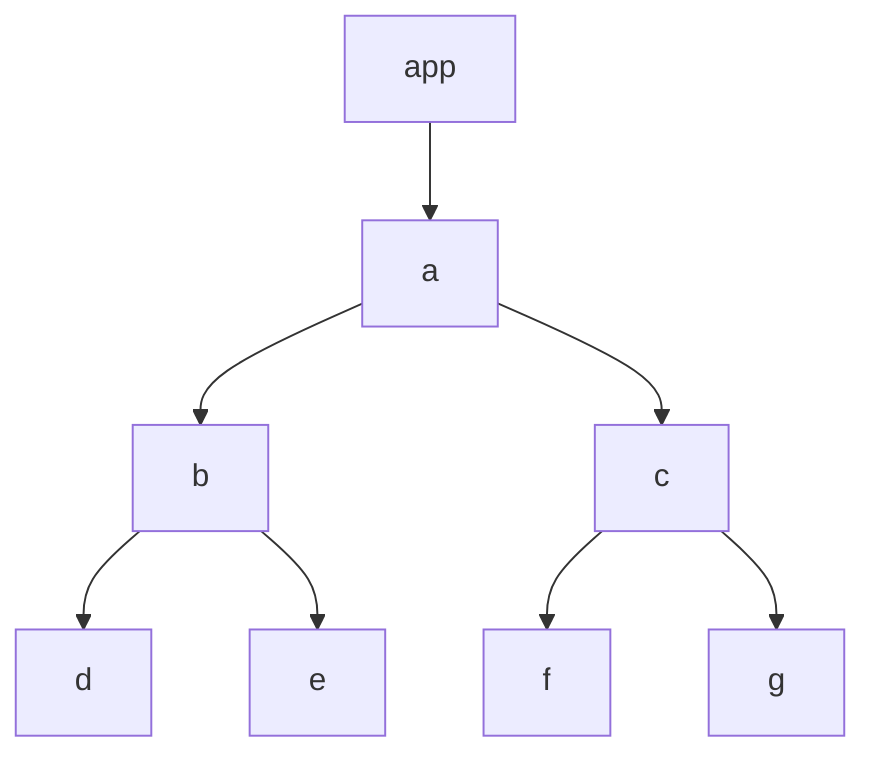

# mini-react

刷了九天的 mini-react 副本，收获了经验值：编程等级+2，道具：mini-react，能力：任务拆分+2。

## mini-react

上周末，参加了大崔老师的 mini-react 副本课程，进行了七天的课程学习，一天复习，一天总结，仅支付了一杯咖啡的门票，但收获丰富。

## 课程内容

首先，是有七天的视频课程，每天的视频时长大概在半小时左右，但是大崔老师讲的连贯，没有任何停顿的地方，所以信息量比较大。我个人学习的话，半小时的课程，我需要花费三小时，才能写出类似的课程代码，并且对课程内容有 50%的理解。
除此之外，课程还有打卡活动，在学习群里，大家每天讨论共同的学习内容，提醒打卡，分享学习进度，互相帮助，氛围很好。
而且，最后完成全部课程的同学，还能参加抽奖活动，有机械键盘，mini-vue 课程和前端测试课兑换券，还有书籍，奖品丰富。

## 课程学习

课程内容对于我来说，是远比日常工作难度要高很多。

1. 首先是数据结构，在平常的工作中，用到的数据结构几乎就是数组和对象，顶多有二维数组。但是在 mini-react 中，使用到的数据结构是链表，虽然这个不是很难，但是在我开发中应用场景很少。
2. 关于部分变量，贯穿了整个 mini-react 的执行过程，对于代码执行和变量跟踪，有着较大的难度。平时在业务开发中，几乎一个变量顶多被两三个函数使用，而且变量的数据结构不会很复杂，大部分时候都是 form 表单的内容，或者列表展示的内容。
3. 了解了一些平时不常用的 api 和代码技巧，`requestIdleCallback`,`function foo(arg1,...args){}`
4. react 的基本执行流程，首先是 fiber 数据结构，实际上就是链表。
   首先 vdom 的数据结构是

```js
const vdom = {
  type: "div",
  props: {
    children: [
      {
        type: "TEXT_ELEMENT",
        props: {
          nodeValue: "hello, mini-react",
          children: [],
        },
      },
      {
        type: "f Count()",
        props: { num: 10, children: [] },
      },
    ],
  },
};
```

将 vdom 转换成更适合分割任务的数据结构，链表，方便进行任务的拆分，以及渲染



转换成链表的规则：

> 1. 先 child
> 2. 然后 sibling
> 3. 最后 parent.sibling

上面的转换成链表就是：a --> b --> d --> e --> c --> f --> g
将上述用 fiber 数据结构表示出来，如下

```js
const fiber = {
  type: "div",
  props: { children: [], id: "app" },
  dom: document.createElement("div"),
  child: fiberChild,
  sibling: null,
  parent: null,
  alternate: null, //旧的fiber
  effectTag: "PLACEMENT",
};
```

然后，就是执行过程，使用`requestIdleCallback`来执行，当有空余时间，就开始执行任务，当没有空余时间，则执行`requestIdleCallback`,等待下次有空闲时间，执行任务。

## 通关副本
我十分艰难的通关了本次副本，为了以后可以做到更轻松一些通关副本，我还需要继续提升自己，需要通过四象限循环，来进行持续提升，想，做，学，迭代。反复挑战该副本，持续优化，迭代自己的mini-react。


四象限循环，想，做，学，迭代
失败是成功之母：如果不做，就是不存在
